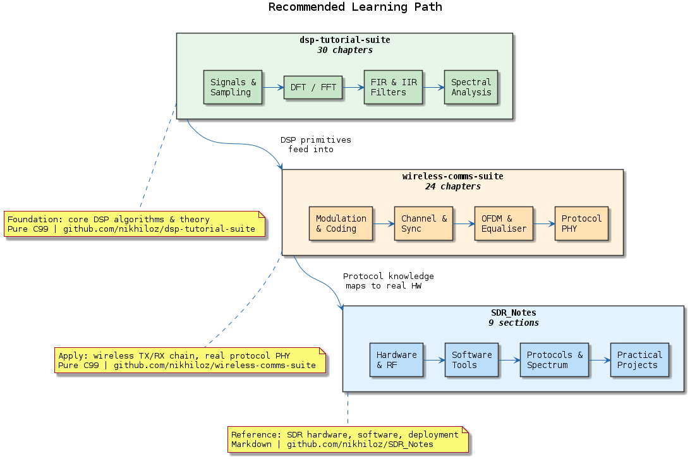
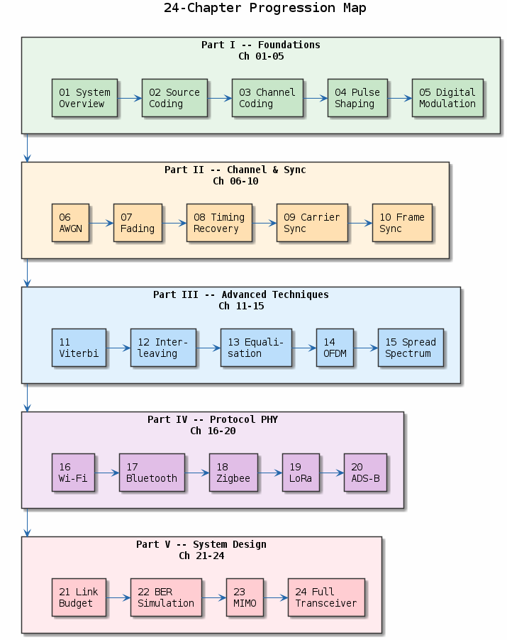
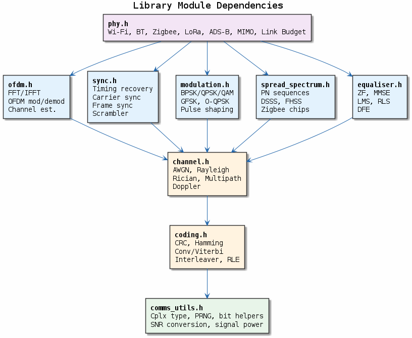

# Wireless Communication Systems — C Tutorial Suite

**A progressive, self-contained C99 tutorial covering the complete digital communication chain — from source coding through real wireless protocol PHY implementations.**

Built as the practical bridge between [dsp-tutorial-suite](https://github.com/nikhiloz/dsp-tutorial-suite) (DSP algorithms) and [SDR_Notes](https://github.com/nikhiloz/SDR_Notes) (hardware/protocol reference).

### Learning Path


---

## Highlights

- **24 chapters** — each with a runnable `demo.c` + an explanatory `README.md`
- **43 PlantUML diagrams** — concept overviews and code-flow charts embedded in every chapter README
- **9 library modules** (modulation, coding, channel, sync, OFDM, spread spectrum, equaliser, PHY, utils)
- **53 unit tests** across 8 test suites — all passing
- **Pure C99**, zero external dependencies (only `math.h` / `stdlib.h`)
- **Static library** `libwireless_comms.a` for reuse in your own projects
- ASCII constellation diagrams, BER curves, and block diagrams in the terminal

---

## Quick Start

```bash
git clone https://github.com/nikhiloz/wireless-comms-suite.git
cd wireless-comms-suite

make                # build everything (release)
make test           # run all 53 unit tests
make run            # run all 24 chapter demos
```

### Prerequisites

- GCC or Clang with C99 support
- GNU Make
- (optional) Valgrind for `make memcheck`

---

## Project Structure

```
wireless-comms-suite/
├── README.md
├── Makefile
├── include/              9 public headers
│   ├── comms_utils.h         random, complex, SNR helpers
│   ├── modulation.h          BPSK/QPSK/16-QAM, pulse shaping
│   ├── coding.h              CRC, Hamming, conv/Viterbi, interleaver, RLE
│   ├── channel.h             AWGN, Rayleigh, multipath
│   ├── sync.h                timing, carrier, frame sync, scrambler
│   ├── ofdm.h                FFT/IFFT, OFDM modulate/demodulate
│   ├── spread_spectrum.h     PN sequences, DSSS, FHSS, Zigbee chips
│   ├── equaliser.h           ZF, LMS, RLS, DFE
│   └── phy.h                 Wi-Fi, BT, Zigbee, LoRa, ADS-B, MIMO, link budget
├── src/                  9 implementation files (one per header)
├── tests/
│   ├── test_framework.h      header-only test harness
│   ├── test_modulation.c     7 tests
│   ├── test_coding.c         8 tests
│   ├── test_channel.c        6 tests
│   ├── test_sync.c           5 tests
│   ├── test_ofdm.c           5 tests
│   ├── test_spread.c         7 tests
│   ├── test_equaliser.c      5 tests
│   └── test_phy.c            10 tests
├── chapters/             24 directories (demo.c + README.md + diagrams/ each)
├── reference/
│   ├── ARCHITECTURE.md       module dependency graph, conventions
│   └── API.md                full API surface for all 9 modules
├── build/
│   ├── bin/              32 binaries (24 demos + 8 test runners)
│   ├── lib/              libwireless_comms.a
│   └── obj/              compiled objects
└── plots/                (reserved for generated figures)
```

---

## Chapters

### Chapter Progression


### Part I — Foundations

| Ch | Title | Topics |
|----|-------|--------|
| 01 | Digital Communication System Overview | TX/RX block diagram, signal flow |
| 02 | Source Coding | Huffman, run-length, entropy |
| 03 | Channel Coding Basics | Parity, Hamming(7,4), CRC-16/32 |
| 04 | Pulse Shaping & Line Coding | NRZ, Manchester, raised cosine, eye diagram |
| 05 | Digital Modulation | BPSK, QPSK, 16-QAM — constellation + BER |

### Part II — Channel & Synchronisation

| Ch | Title | Topics |
|----|-------|--------|
| 06 | AWGN Channel Simulation | Gaussian noise generation, SNR control |
| 07 | Fading Channels | Rayleigh, Rician, multipath, Doppler |
| 08 | Symbol Timing Recovery | Gardner, Mueller-Muller |
| 09 | Carrier Synchronisation | Costas loop, PLL, frequency offset |
| 10 | Frame Synchronisation | Preamble correlation, Barker codes |

### Part III — Advanced Techniques

| Ch | Title | Topics |
|----|-------|--------|
| 11 | Convolutional Codes + Viterbi Decoder | Rate-1/2 K=7, trellis, traceback |
| 12 | Interleaving | Block interleaver, burst error protection |
| 13 | Channel Equalisation | ZF, LMS, RLS, DFE |
| 14 | OFDM | FFT/IFFT TX/RX, cyclic prefix, pilot tones |
| 15 | Spread Spectrum | DSSS, FHSS, PN sequences, processing gain |

### Part IV — Real Protocol PHY Implementations

| Ch | Title | Topics |
|----|-------|--------|
| 16 | 802.11a/g Wi-Fi OFDM PHY | Scrambler → conv coder → interleaver → OFDM |
| 17 | Bluetooth Baseband | GFSK, whitening, access code, packet format |
| 18 | Zigbee / IEEE 802.15.4 PHY | O-QPSK, DSSS chip spreading |
| 19 | LoRa PHY | CSS chirps, spreading factors, demodulation |
| 20 | ADS-B / Mode S PHY | PPM, preamble detect, CRC-24 |

### Part V — System Design

| Ch | Title | Topics |
|----|-------|--------|
| 21 | Link Budget | Friis equation, noise figure, fade margin |
| 22 | BER/PER Monte Carlo Simulation | Simulation framework, confidence intervals |
| 23 | MIMO & Spatial Diversity | Alamouti STBC, MRC, ZF detection |
| 24 | Full Transceiver Capstone | TX → channel → RX end-to-end pipeline |

**Run a single chapter demo:**

```bash
make release
./build/bin/05-modulation
./build/bin/17-bluetooth-baseband
./build/bin/24-transceiver
```

---

## Library Modules

### Module Dependency Graph


| Header | Description | Key Functions |
|--------|-------------|---------------|
| `comms_utils.h` | Random numbers, complex arithmetic, SNR | `randn()`, `cplx_mul()`, `signal_power_cplx()` |
| `modulation.h` | Digital modulation & pulse shaping | `mod_modulate()`, `mod_demodulate()`, `raised_cosine()` |
| `coding.h` | FEC, CRC, interleaving | `conv_encode()`, `viterbi_decode()`, `hamming74_encode()`, `crc16_ccitt()` |
| `channel.h` | Channel models | `channel_awgn()`, `channel_rayleigh_flat()`, `channel_multipath_apply()` |
| `sync.h` | Synchronisation | `frame_sync_detect()`, `scrambler()`, `timing_init()`, `carrier_init()` |
| `ofdm.h` | OFDM & FFT | `fft()`, `ifft()`, `ofdm_modulate()`, `ofdm_demodulate()` |
| `spread_spectrum.h` | DSSS, FHSS, PN codes | `pn_msequence()`, `pn_gold()`, `dsss_spread()`, `fhss_init()` |
| `equaliser.h` | Adaptive equalisers | `eq_zf_flat()`, `eq_lms_step()`, `eq_rls_step()`, `eq_dfe_step()` |
| `phy.h` | Protocol PHY layers & link budget | `wifi_build_ppdu()`, `bt_build_packet()`, `lora_mod()`, `adsb_encode()`, `link_fspl_db()` |

See [reference/API.md](reference/API.md) for the complete API surface.

---

## Build Targets

| Target | Description |
|--------|-------------|
| `make` / `make release` | Build static library + all 24 demos + 8 test binaries (optimised) |
| `make debug` | Build with `-g -O0 -DDEBUG` |
| `make lib` | Build only `libwireless_comms.a` |
| `make test` | Run all 53 unit tests |
| `make run` | Run all 24 chapter demos |
| `make memcheck` | Run tests under Valgrind |
| `make format` | Format all source with `clang-format` |
| `make lint` | Static analysis with `clang-tidy` |
| `make install` | Install headers + library to `/usr/local` |
| `make clean` | Remove `build/` directory |
| `make distclean` | Remove all generated artifacts |
| `make help` | Print target summary |

---

## Companion Repositories

| Aspect | [dsp-tutorial-suite](https://github.com/nikhiloz/dsp-tutorial-suite) | [SDR_Notes](https://github.com/nikhiloz/SDR_Notes) | **wireless-comms-suite** |
|--------|------------------------|---------------|------------------------|
| Purpose | Core DSP algorithms & theory | SDR hardware/software reference | Wireless communication systems |
| Content | Executable code + markdown | Documentation only | Executable code + markdown |
| Language | Pure C99 | Markdown | Pure C99 |
| Chapters | 30 (signals, transforms, filters) | 9 sections | 24 (modulation → protocols) |
| Protocol PHY | — | Reference docs | Wi-Fi, BT, Zigbee, LoRa, ADS-B |

**Recommended learning path:**

```
dsp-tutorial-suite  (Foundation: FFT, filters, spectral analysis)
        ↓
wireless-comms-suite  (Apply: modulation, coding, channel, protocol PHY)
        ↓
SDR_Notes  (Reference: hardware, RF, real-world deployment)
```

---

## Design Conventions

- **C99 strict** — compiled with `-std=c99 -Wall -Wextra -Werror`
- **Caller-allocates buffers** — no hidden `malloc` inside library functions
- **Module-prefix naming** — `mod_*`, `eq_*`, `bt_*`, `wifi_*`, etc.
- **Doxygen-style comments** — `@file`, `@brief`, `@param`, `@return`
- **snake_case** throughout; `/* ════════ */` section dividers
- **Paired tutorial + code** per chapter (`README.md` + `demo.c`)
- Architecture details in [reference/ARCHITECTURE.md](reference/ARCHITECTURE.md)

---

## References

- Haykin, *Communication Systems* (4th ed.)
- Proakis & Salehi, *Digital Communications* (5th ed.)
- Sklar, *Digital Communications: Fundamentals and Applications*
- IEEE 802.11-2020 (Wi-Fi PHY)
- Bluetooth Core Specification v5.4
- IEEE 802.15.4-2020 (Zigbee PHY)
- Semtech AN1200.22 (LoRa modulation basics)
- ICAO Annex 10, Vol. IV (Mode S / ADS-B)

---

## License

MIT

## Author

Nikhil Pandey