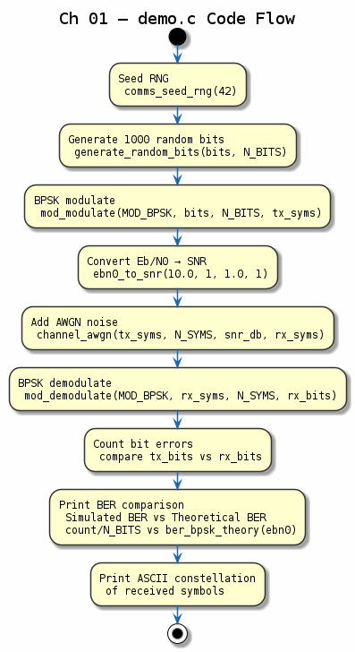

# Chapter 01 — Digital Communication System Overview

## Objective
Understand the end-to-end TX → Channel → RX digital communication pipeline.

## Block Diagram
```
Source → [Encoder] → [Modulator] → [Channel] → [Demodulator] → [Decoder] → Sink
  bits      FEC         BPSK         AWGN         hard/soft       Viterbi    bits
```

## Key Concepts
- **Transmitter**: Source coding, channel coding, modulation, pulse shaping
- **Channel**: AWGN, fading, multipath, Doppler
- **Receiver**: Matched filter, demodulation, decoding, synchronisation
- **BER**: Bit Error Rate — fundamental performance metric

## Demo
```bash
make build/bin/01-system-overview && ./build/bin/01-system-overview
```

The demo sends 1000 random bits through BPSK modulation over an AWGN channel at 10 dB SNR, then measures BER vs. theoretical prediction.

## References
- Haykin, *Communication Systems*, Chapter 1
- Proakis & Salehi, *Digital Communications*, Chapter 1

---
## Diagrams

### Concept — System Block Diagram


End-to-end digital communications pipeline: source bits → encoder → modulator → AWGN channel → demodulator → decoder → recovered bits. Each block maps directly to a library module in the suite.

### Code Flow — `demo.c`


Walkthrough of the chapter demo: seed RNG, generate 1000 random bits, BPSK-modulate, convert Eb/N0 to linear SNR, add AWGN noise, demodulate, count errors, and print simulated vs. theoretical BER.

---
[← Home](../../README.md) | [Next: Source Coding →](../02-source-coding/README.md)
