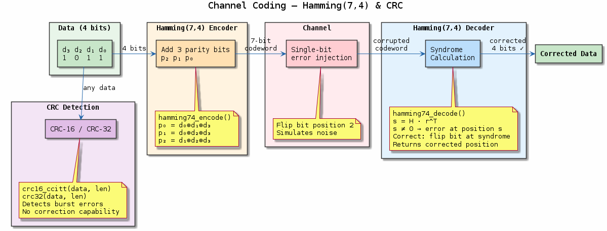
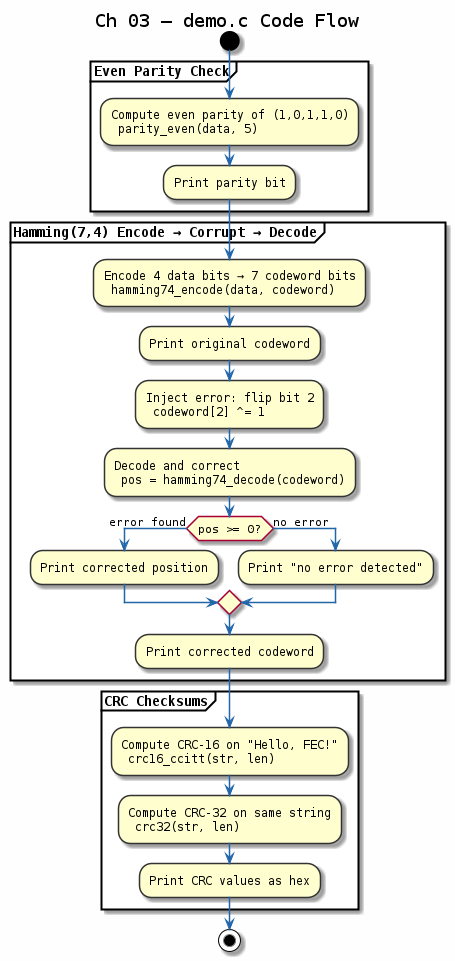

# Chapter 03 — Channel Coding Basics

## Objective
Introduce error detection and correction codes for reliable transmission.

## Key Concepts
- **Parity**: Simplest error detection — single-bit overhead
- **Hamming(7,4)**: Corrects 1-bit errors in 7-bit codewords
- **CRC-16/32**: Cyclic Redundancy Check for burst error detection

## Demo
```bash
make build/bin/03-channel-coding && ./build/bin/03-channel-coding
```

## References
- Hamming, "Error Detecting and Error Correcting Codes" (1950)
- Proakis, *Digital Communications*, Ch. 6

---
## Diagrams

### Concept — Hamming(7,4) & CRC


Hamming(7,4) encode → channel corruption → syndrome decode pipeline, showing how 3 parity bits enable single-error correction. CRC-16/32 complements with burst-error detection.

### Code Flow — `demo.c`


Three-part demo: (1) compute even parity, (2) Hamming-encode 4 bits, inject a 1-bit error, and decode with correction, (3) CRC-16 and CRC-32 checksums on a test string.

---
[← Source Coding](../02-source-coding/README.md) | [Next: Pulse Shaping →](../04-pulse-shaping/README.md)
