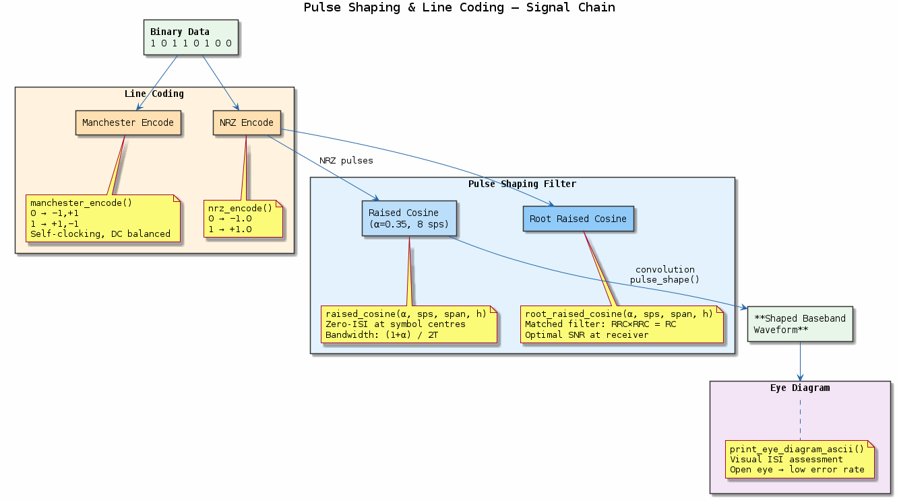
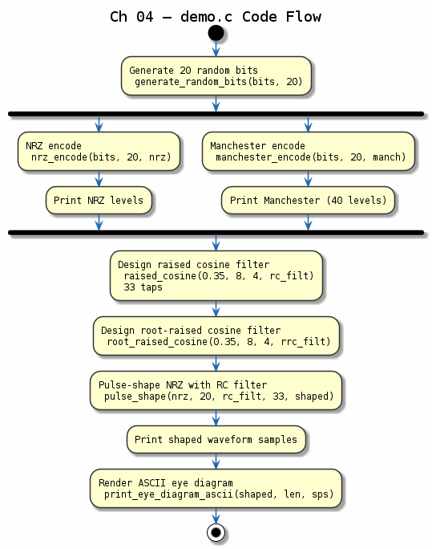

# Chapter 04 — Pulse Shaping & Line Coding

## Objective
Learn how binary data is converted to analog-friendly waveforms and filtered to control bandwidth.

## Key Concepts
- **NRZ**: Non-Return-to-Zero (0→-1, 1→+1)
- **Manchester**: Self-clocking encoding (transitions at every bit boundary)
- **Raised Cosine**: Nyquist filter satisfying ISI-free criterion
- **Root-Raised Cosine**: Matched filter pair (TX RRC × RX RRC = RC)
- **Eye Diagram**: Overlaid traces revealing ISI, timing jitter, noise margin

## Demo
```bash
make build/bin/04-pulse-shaping && ./build/bin/04-pulse-shaping
```

## References
- Haykin, *Communication Systems*, §6.3 (Nyquist criterion)
- Sklar, *Digital Communications*, Ch. 3

---
## Diagrams

### Concept — Pulse Shaping & Line Coding


NRZ and Manchester line codes, the raised-cosine Nyquist filter family (roll-off α = 0 to 1), matched RRC filter pairs for ISI-free communication, and eye diagram interpretation.

### Code Flow — `demo.c`


Demo walkthrough: NRZ and Manchester encoding of test bits, raised-cosine and RRC pulse generation at various roll-offs, upsampled pulse-shaped waveform, and ASCII eye diagram output.

---
[← Channel Coding](../03-channel-coding/README.md) | [Next: Modulation →](../05-modulation/README.md)
