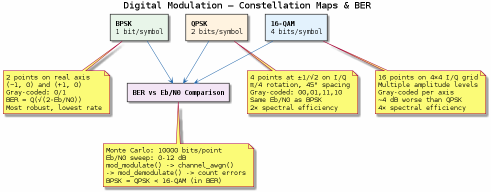
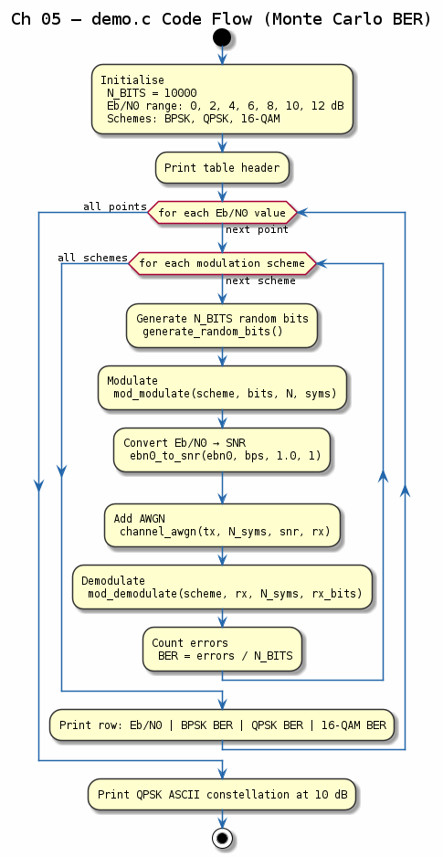

# Chapter 05 — Digital Modulation

## Objective
Implement and compare BPSK, QPSK, and 16-QAM modulation schemes.

## Key Concepts
- **BPSK**: 1 bit/symbol, most robust, ±1 on real axis
- **QPSK**: 2 bits/symbol, same BER as BPSK per bit, 4 constellation points
- **16-QAM**: 4 bits/symbol, higher throughput, needs more SNR
- **Gray Coding**: Adjacent constellation points differ by 1 bit
- **BER Curves**: Performance comparison over AWGN channel

## Demo
```bash
make build/bin/05-modulation && ./build/bin/05-modulation
```

## References
- Proakis, *Digital Communications*, Ch. 4
- Haykin, *Communication Systems*, §5

---
## Diagrams

### Concept — Constellation Maps & BER


BPSK, QPSK, and 16-QAM constellation maps with Gray coding, showing the trade-off between bits/symbol and required Eb/N0. Bottom panel summarises the Monte Carlo BER comparison methodology.

### Code Flow — `demo.c`


Demo walkthrough: sweep Eb/N0 from 0–12 dB for each modulation scheme, modulate → AWGN → demodulate → count errors, and print/compare against theoretical BER curves.

---
[← Pulse Shaping](../04-pulse-shaping/README.md) | [Next: AWGN Channel →](../06-awgn-channel/README.md)
