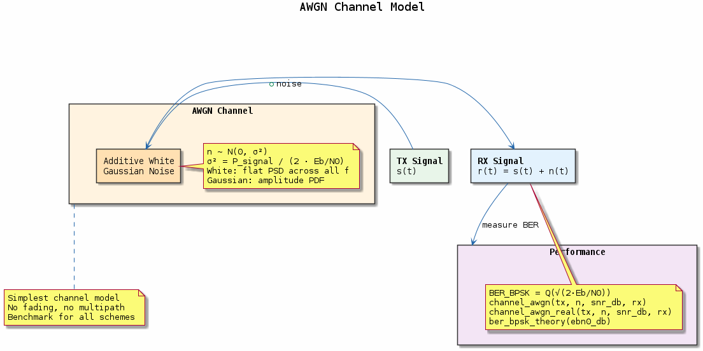

# Chapter 06 — AWGN Channel Simulation

## Objective
Simulate the Additive White Gaussian Noise channel and validate BER predictions.

## Key Concepts
- **AWGN**: n ~ N(0, σ²), σ² = N₀/2
- **Eb/N0**: Energy per bit to noise PSD ratio — universal comparison metric
- **SNR conversion**: SNR = Eb/N0 + 10·log₁₀(k) where k = bits/symbol
- **Box-Muller**: Generate Gaussian samples from uniform random variables

## Demo
```bash
make build/bin/06-awgn-channel && ./build/bin/06-awgn-channel
```

---
## Diagrams

### Concept — AWGN Channel Model


The additive white Gaussian noise channel: signal plus i.i.d. Gaussian noise samples. Shows Eb/N0 → SNR conversion, Box-Muller Gaussian generation, and BER validation against Q-function theory.

---
[← Modulation](../05-modulation/README.md) | [Next: Fading Channels →](../07-fading-channels/README.md)
