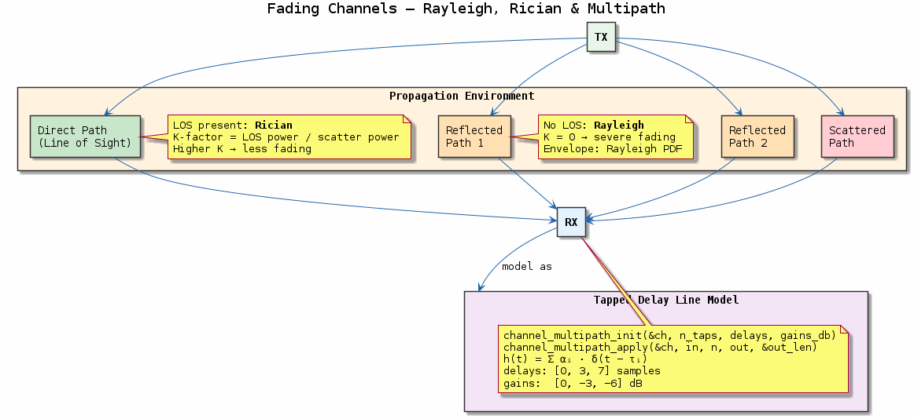
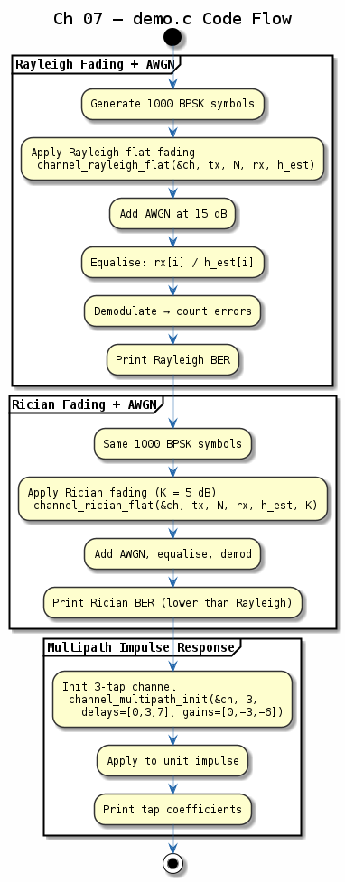

# Chapter 07 — Fading Channels

## Objective
Model wireless propagation effects: flat/frequency-selective fading, multipath, Doppler.

## Key Concepts
- **Rayleigh**: No LOS — envelope is Rayleigh-distributed
- **Rician**: LOS + scattered — K-factor controls ratio
- **Multipath**: Tapped delay line (TDL) model
- **Doppler shift**: f_d = v·f_c/c — time-varying channel

---
## Diagrams

### Concept — Fading Channel Models

Rayleigh (NLOS) and Rician (LOS + scatter) fading distributions, tapped delay line multipath model, and Doppler spread from mobile motion — the key wireless propagation impairments.

### Code Flow — `demo.c`

Demo walkthrough: generate Rayleigh envelope statistics, apply Rician fading with K-factor, run a multipath TDL channel, and measure Doppler-induced frequency offset.

---
[← AWGN Channel](../06-awgn-channel/README.md) | [Next: Timing Recovery →](../08-timing-recovery/README.md)
