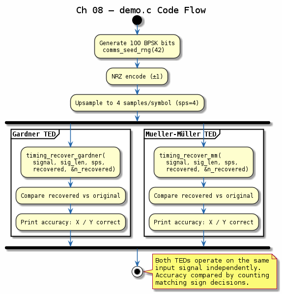

# Chapter 08 — Symbol Timing Recovery

## Objective
Recover symbol timing at the receiver when the sampling clock isn't synchronised to the transmitter.

## Key Concepts
- **Gardner TED**: Non-data-aided, works at 2 samples/symbol
- **Mueller-Muller TED**: Decision-directed, uses detected symbols
- **Loop filter**: PI controller drives NCO for sample timing adjustment
- **Interpolation**: Linear/cubic interpolation between samples

---
## Diagrams

### Concept — Timing Recovery Loop

Gardner and Mueller-Muller timing error detectors feeding a PI loop filter that drives an NCO for sample-time adjustment, with interpolation between received samples.

### Code Flow — `demo.c`

Demo walkthrough: generate BPSK symbols at 2× oversampling with a fractional timing offset, run the Gardner TED loop to converge, and report steady-state timing error.

---
[← Fading Channels](../07-fading-channels/README.md) | [Next: Carrier Sync →](../09-carrier-sync/README.md)
