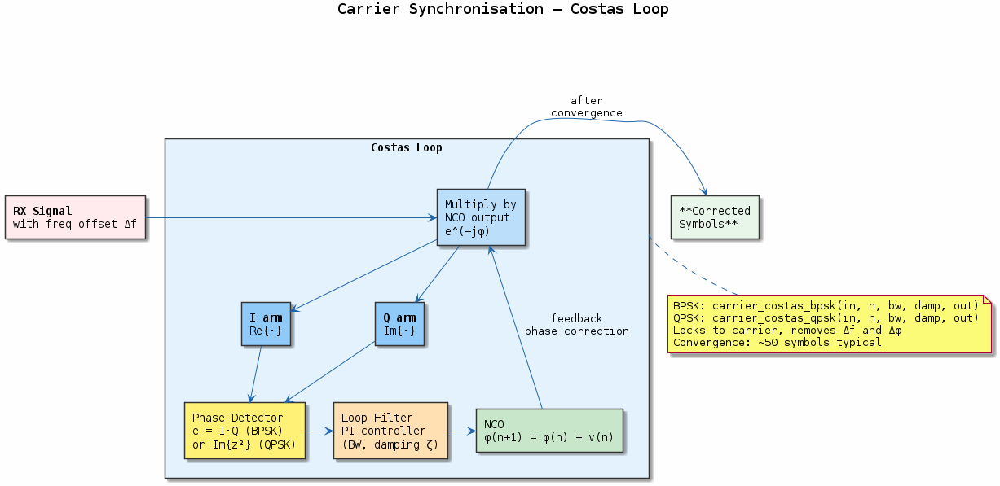
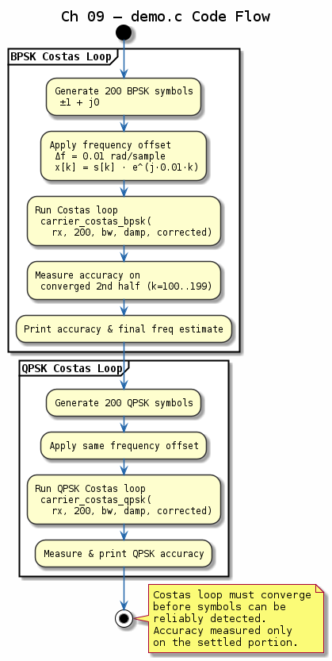

# Chapter 09 — Carrier Synchronisation

## Objective
Correct frequency and phase offsets between transmitter and receiver local oscillators.

## Key Concepts
- **Costas Loop**: Squaring-based carrier recovery for BPSK/QPSK
- **PLL**: Phase-locked loop tracks carrier phase
- **Frequency offset**: Residual CFO after down-conversion
- **Loop bandwidth**: Trade-off between acquisition speed and noise rejection

---
## Diagrams

### Concept — Costas Loop

Costas-loop carrier recovery for BPSK and QPSK: I/Q arm multipliers, loop filter, and VCO phase correction. Shows acquisition range vs. loop bandwidth trade-off.

### Code Flow — `demo.c`

Demo walkthrough: apply a carrier frequency offset to BPSK symbols, run the Costas loop to lock, and report residual phase error after convergence.

---
[← Timing Recovery](../08-timing-recovery/README.md) | [Next: Frame Sync →](../10-frame-sync/README.md)
