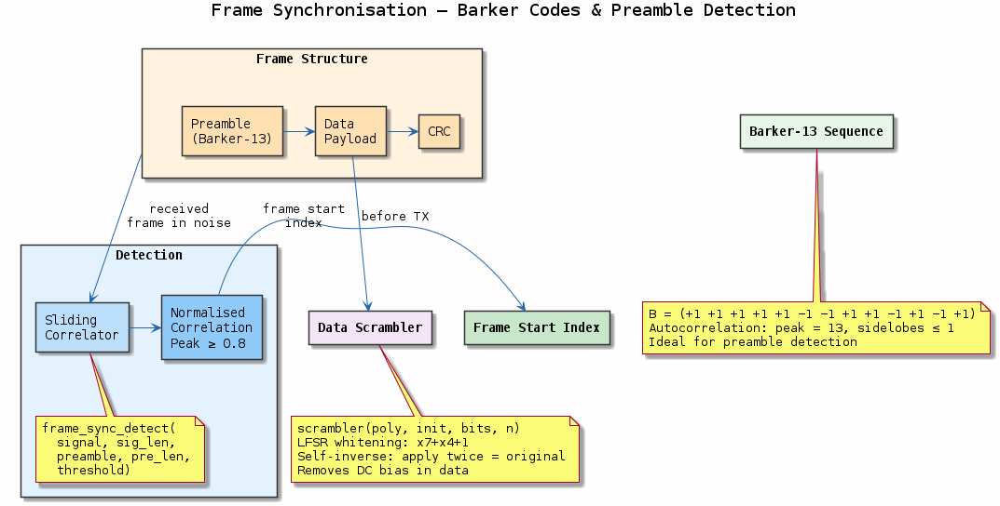
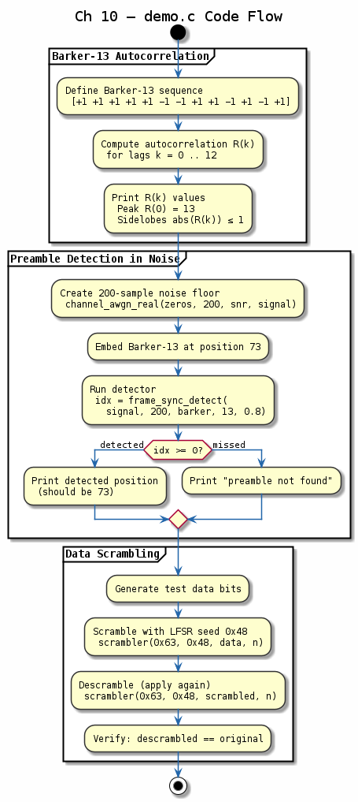

# Chapter 10 — Frame Synchronisation

## Objective
Detect frame boundaries in a received signal using correlation with known sequences.

## Key Concepts
- **Barker codes**: Low sidelobe autocorrelation (7, 11, 13 lengths)
- **Correlation**: Sliding dot product to find preamble
- **Threshold**: SNR-dependent detection threshold
- **Scrambler**: Whitens data to avoid long runs of identical bits

---
## Diagrams

### Concept — Frame Synchronisation

Barker-13 preamble with ideal autocorrelation properties, frame structure (preamble + data + CRC), sliding correlator detection, and LFSR data scrambler for DC removal.

### Code Flow — `demo.c`

Demo walkthrough: compute Barker-13 autocorrelation, embed preamble in noise and detect its position, and verify scrambler self-inverse property.

---
[← Carrier Sync](../09-carrier-sync/README.md) | [Next: Convolutional Coding →](../11-convolutional-viterbi/README.md)
