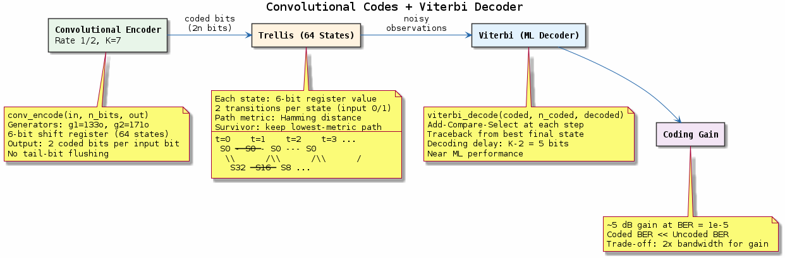
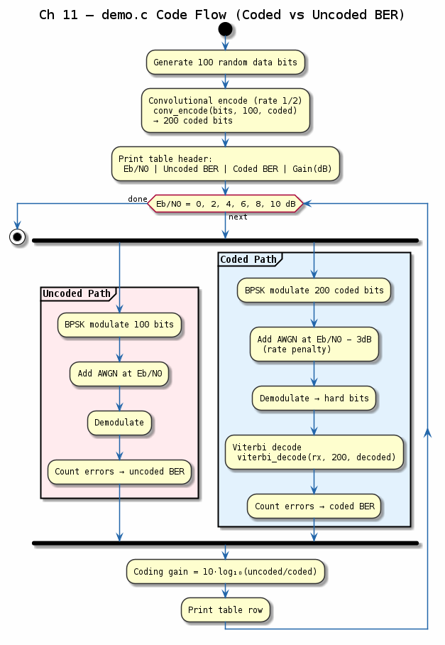

# Chapter 11 — Convolutional Codes + Viterbi Decoder

## Objective
Implement a rate-1/2, constraint-length-7 convolutional encoder and Viterbi decoder.

## Key Concepts
- **Convolutional code**: Memory-based coding with generators g₀=133₈, g₁=171₈
- **Trellis**: State machine representation (64 states for K=7)
- **Viterbi algorithm**: Maximum likelihood sequence detection, path metric accumulation
- **Coding gain**: dB improvement vs uncoded at same BER

---
## Diagrams

### Concept — Convolutional Code + Viterbi

Rate-1/2 K=7 convolutional encoder, 64-state trellis with survivor path selection, Viterbi maximum-likelihood decoder, and the resulting ~5 dB coding gain.

### Code Flow — `demo.c`

Demo walkthrough: encode random bits, add AWGN noise, Viterbi-decode, and compare coded vs. uncoded BER across a range of Eb/N0 values.

---
[← Frame Sync](../10-frame-sync/README.md) | [Next: Interleaving →](../12-interleaving/README.md)
