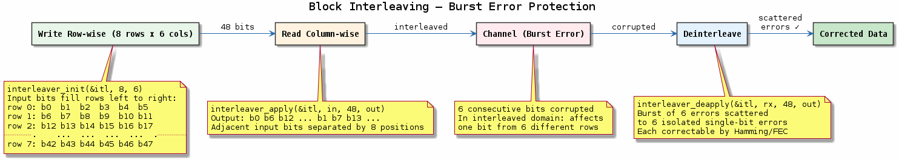

# Chapter 12 — Interleaving

## Objective
Break up burst errors into scattered errors that FEC codes can correct.

## Key Concepts
- **Block interleaver**: Write rows, read columns (row × col matrix)
- **Burst errors**: Fading causes clustered errors
- **Diversity**: Temporal diversity via interleaving

---
## Diagrams

### Concept — Block Interleaver

Write-row/read-column block interleaver (8×6 matrix): adjacent bits are separated by 8 positions after interleaving, so a burst of 6 errors becomes 6 isolated single-bit errors correctable by FEC.

---
[← Convolutional Coding](../11-convolutional-viterbi/README.md) | [Next: Equalisation →](../13-equalisation/README.md)
