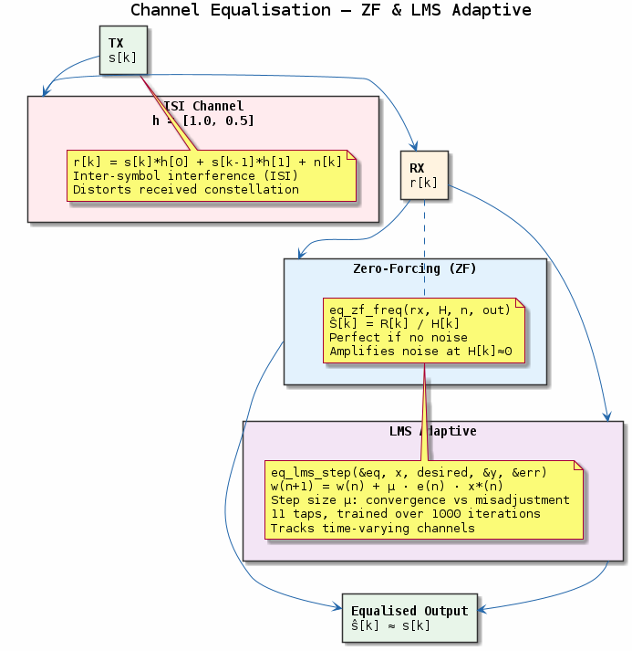
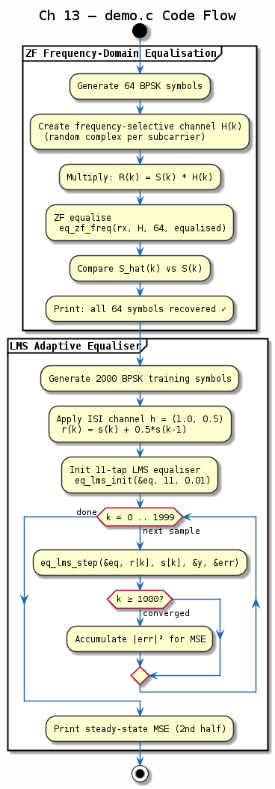

# Chapter 13 — Channel Equalisation

## Objective
Compensate for ISI introduced by frequency-selective channels.

## Key Concepts
- **ZF equaliser**: H⁻¹ — perfect ISI removal, noise enhancement at nulls
- **MMSE equaliser**: Minimises mean squared error, balances ISI and noise
- **LMS adaptive**: Iterative, low complexity, O(N) per sample
- **RLS adaptive**: Faster convergence, O(N²) per sample
- **DFE**: Decision feedback eliminates post-cursor ISI

---
## Diagrams

### Concept — Channel Equalisation

ZF and MMSE frequency-domain equalisers, LMS/RLS adaptive equalisers, and decision-feedback equaliser (DFE) — the main strategies for undoing inter-symbol interference.

### Code Flow — `demo.c`

Two-part demo: (1) ZF frequency-domain equalisation of 64 BPSK subcarriers through a random channel, (2) 11-tap LMS adaptive equaliser converging over 2000 training symbols.

---
[← Interleaving](../12-interleaving/README.md) | [Next: OFDM →](../14-ofdm/README.md)
