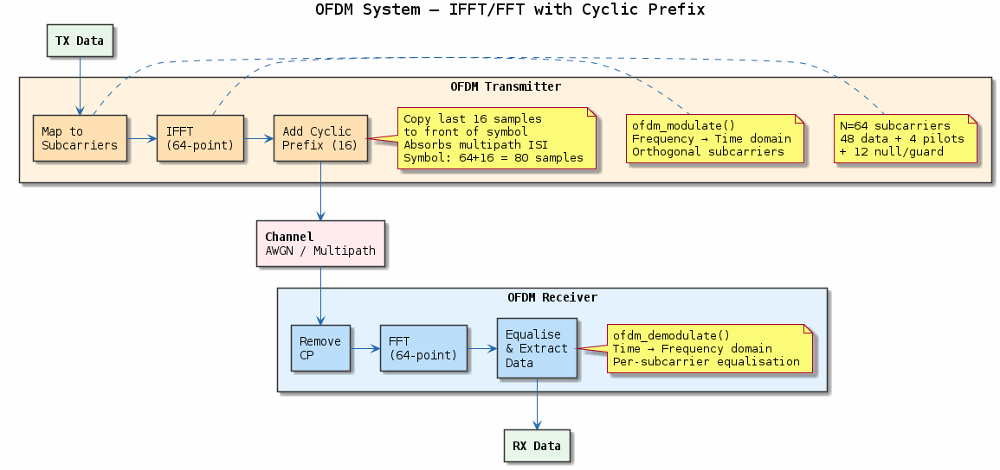
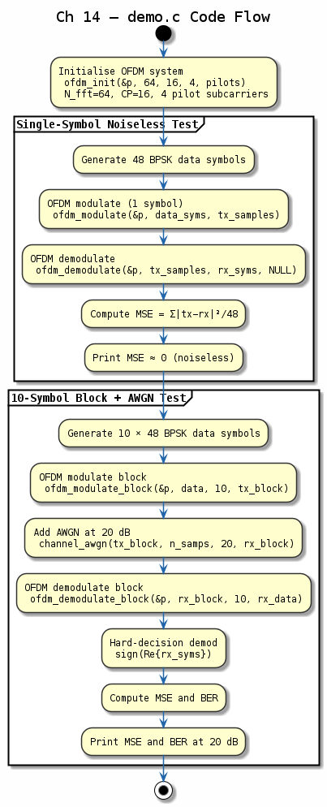

# Chapter 14 — OFDM

## Objective
Implement a complete OFDM transceiver: IFFT modulation, cyclic prefix, FFT demodulation, pilot-based channel estimation.

## Key Concepts
- **OFDM**: Orthogonal Frequency Division Multiplexing — parallel narrowband subcarriers
- **Cyclic prefix**: Guard interval eliminates ISI, makes channel appear circular
- **Pilot tones**: Known symbols for channel estimation and tracking
- **Channel estimation**: Least squares at pilots + linear interpolation

---
## Diagrams

### Concept — OFDM Transceiver

OFDM block diagram: serial-to-parallel, IFFT modulation, cyclic prefix insertion, channel, CP removal, FFT demodulation, and pilot-based LS channel estimation with interpolation.

### Code Flow — `demo.c`

Demo walkthrough: generate 48 QPSK data subcarriers + 4 pilots, OFDM-modulate with 16-sample CP, pass through a 2-tap channel, demodulate, estimate/equalise, and verify symbol recovery.

---
[← Equalisation](../13-equalisation/README.md) | [Next: Spread Spectrum →](../15-spread-spectrum/README.md)
