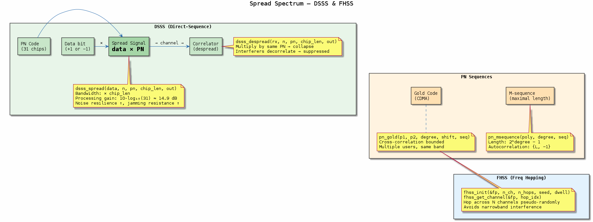
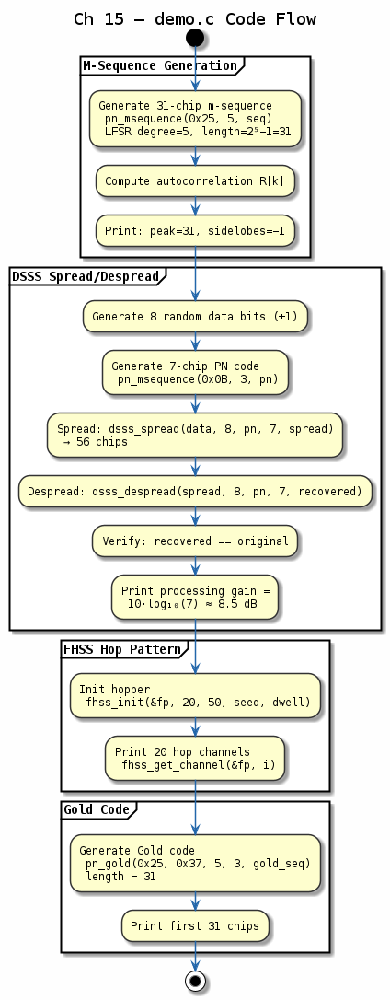

# Chapter 15 — Spread Spectrum

## Objective
Implement DSSS and FHSS schemes used in Wi-Fi, Bluetooth, GPS, and CDMA.

## Key Concepts
- **PN sequences**: Pseudorandom ±1 sequences with good autocorrelation
- **DSSS**: Direct-sequence — multiply data by high-rate PN code
- **Processing gain**: G_p = 10·log₁₀(chip_rate/data_rate)
- **FHSS**: Frequency hopping — change carrier frequency per hop
- **Gold codes**: Paired m-sequences for CDMA multiple access

---
## Diagrams

### Concept — Spread Spectrum

DSSS: data × PN-code spreading and despreading with processing gain. FHSS: carrier hops across frequencies per time slot. Gold codes enable CDMA multi-user access.

### Code Flow — `demo.c`

Demo walkthrough: generate a PN sequence and verify its autocorrelation, DSSS-spread and despread data bits, compute processing gain, and demonstrate a simple FHSS hop pattern.

---
[← OFDM](../14-ofdm/README.md) | [Next: Wi-Fi PHY →](../16-wifi-phy/README.md)
