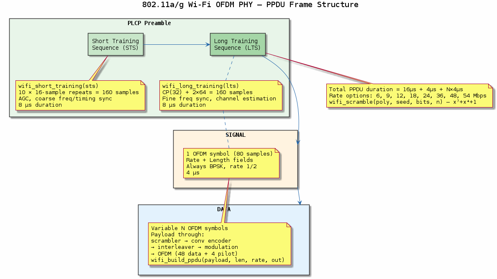
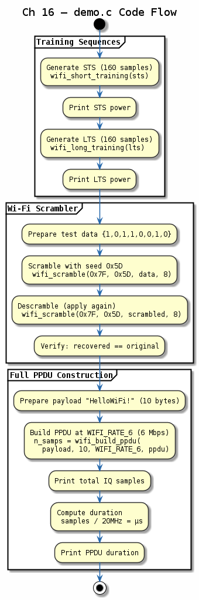

# Chapter 16 — 802.11a/g Wi-Fi OFDM PHY

## Objective
Build a simplified 802.11a/g OFDM PHY: preamble (STS+LTS), SIGNAL field, scrambled/coded/interleaved data.

## Key Concepts
- **PPDU**: PLCP Protocol Data Unit = Preamble + SIGNAL + DATA
- **STS**: Short Training Sequence (10 × 16-sample, AGC + coarse sync)
- **LTS**: Long Training Sequence (32 CP + 2 × 64, fine sync + channel est)
- **OFDM**: 64-point FFT, 48 data + 4 pilot subcarriers, 16-sample CP

## References
- IEEE 802.11-2020, §17.3

---
## Diagrams

### Concept — 802.11a/g PPDU Structure

802.11a/g OFDM PPDU fields: Short Training Sequence (STS) for AGC and coarse sync, Long Training Sequence (LTS) for fine sync and channel estimation, SIGNAL field, and scrambled/coded data OFDM symbols.

### Code Flow — `demo.c`

Demo walkthrough: generate STS and LTS preamble, build a SIGNAL field with rate/length, construct a full PPDU frame, and print field sizes and total sample count.

---
[← Spread Spectrum](../15-spread-spectrum/README.md) | [Next: Bluetooth →](../17-bluetooth-baseband/README.md)
