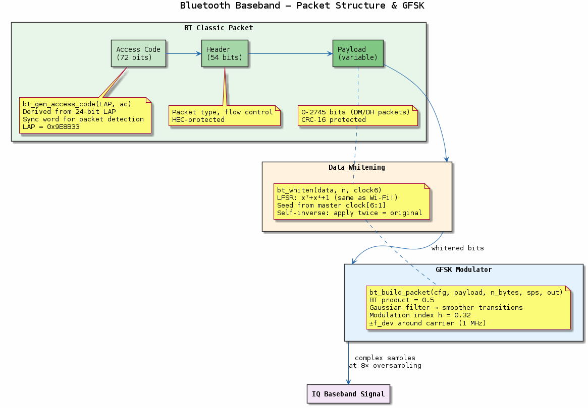
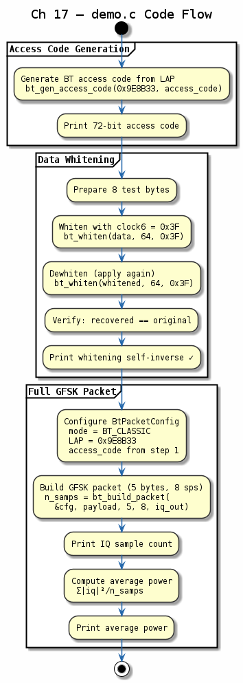

# Chapter 17 — Bluetooth Baseband

## Objective
Implement Bluetooth Classic and BLE packet construction and GFSK modulation.

## Key Concepts
- **Access code**: 72 bits — preamble + sync word (LAP-based) + trailer
- **GFSK**: Gaussian FSK — BT×T product controls spectral efficiency
- **Whitening**: x⁷+x⁴+1 LFSR to avoid DC bias and improve sync
- **Packet format**: Access code → Header → Payload

## References
- Bluetooth Core Spec v5.4, Vol. 6, Part B

---
## Diagrams

### Concept — Bluetooth Packet Structure

Bluetooth Classic packet format: 72-bit access code (preamble + sync word + trailer), header with flow/type/HEC, and payload. GFSK modulation and x⁷+x⁴+1 LFSR whitening.

### Code Flow — `demo.c`

Demo walkthrough: build a Bluetooth access code from a LAP, construct a DM1 packet, apply GFSK modulation, and verify CRC and whitening round-trip.

---
[← Wi-Fi PHY](../16-wifi-phy/README.md) | [Next: Zigbee →](../18-zigbee-phy/README.md)
