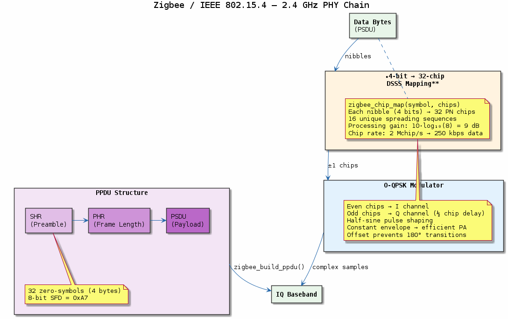

# Chapter 18 — Zigbee / IEEE 802.15.4 PHY

## Objective
Implement the 2.4 GHz IEEE 802.15.4 PHY: O-QPSK modulation with DSSS chip spreading.

## Key Concepts
- **O-QPSK**: Offset QPSK — half-symbol stagger, half-sine pulse
- **DSSS**: 4-bit symbol → 32-chip PN sequence (processing gain ≈ 9 dB)
- **PPDU**: SHR (preamble+SFD) → PHR (frame length) → PSDU (data)
- **Data rate**: 250 kbps, chip rate 2 Mchip/s

## References
- IEEE 802.15.4-2020, §12

---
## Diagrams

### Concept — IEEE 802.15.4 PHY

2.4 GHz 802.15.4 PHY: O-QPSK modulation with half-sine pulse shaping, DSSS chip spreading (4-bit symbol → 32-chip PN), and PPDU structure (SHR + PHR + PSDU) at 250 kbps.

---
[← Bluetooth](../17-bluetooth-baseband/README.md) | [Next: LoRa →](../19-lora-phy/README.md)
