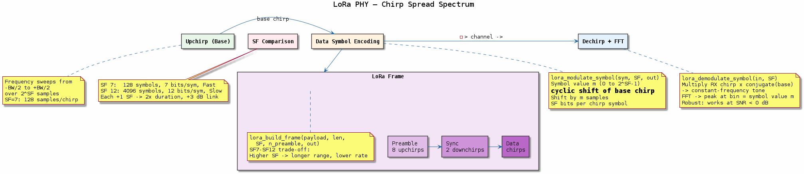

# Chapter 19 — LoRa PHY

## Objective
Implement LoRa CSS (Chirp Spread Spectrum) modulation and demodulation.

## Key Concepts
- **CSS**: Chirp Spread Spectrum — frequency sweeps encode data via cyclic shifts
- **Spreading factor**: SF7–SF12, trade-off data rate vs range
- **Dechirping**: Multiply by conjugate base chirp, then FFT to find peak bin
- **Preamble**: Upchirps for detection + downchirps for sync

## References
- Semtech AN1200.22 (LoRa Modulation Basics)

---
## Diagrams

### Concept — Chirp Spread Spectrum

LoRa modulation: base upchirp, cyclic-shift symbol encoding, dechirp + FFT demodulation, frame structure (preamble + sync + data), and spreading factor SF7–SF12 trade-offs.

### Code Flow — `demo.c`

Demo walkthrough: print SF comparison table, modulate → demodulate round-trip for test symbols at SF=7, and construct a LoRa frame with preamble and payload IQ samples.

---
[← Zigbee](../18-zigbee-phy/README.md) | [Next: ADS-B →](../20-adsb-phy/README.md)
