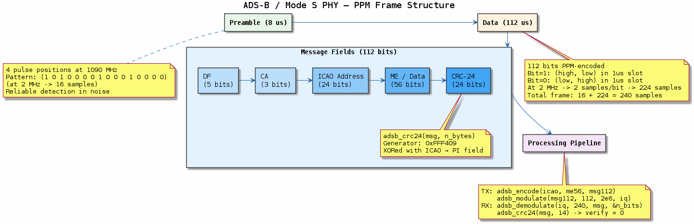

# Chapter 20 — ADS-B / Mode S PHY

## Objective
Implement ADS-B transponder message encoding, PPM modulation, and decoding.

## Key Concepts
- **Mode S**: Selective interrogation — each aircraft has unique ICAO address
- **PPM**: Pulse Position Modulation — bit 1 = [high, low], bit 0 = [low, high]
- **Preamble**: 8 µs with 4 fixed pulses for detection and sync
- **CRC-24**: 24-bit CRC for error detection (generator 0xFFF409)

## References
- ICAO Annex 10, Volume IV

---
## Diagrams

### Concept — ADS-B / Mode S Frame

ADS-B PPM frame: 8 µs preamble with 4 fixed pulses, 112-bit data with PPM encoding, message fields (DF + CA + ICAO + ME + CRC-24), and the encode/modulate/demodulate/CRC pipeline.

### Code Flow — `demo.c`

Demo walkthrough: encode an ADS-B message with ICAO address and ME payload, PPM-modulate to IQ samples, demodulate, and verify CRC-24 integrity.

---
[← LoRa](../19-lora-phy/README.md) | [Next: Link Budget →](../21-link-budget/README.md)
