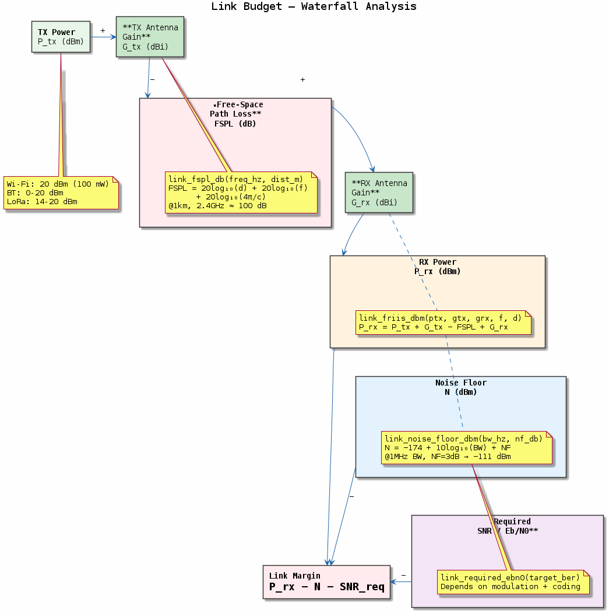

# Chapter 21 — Link Budget

## Objective
Calculate end-to-end link budgets for wireless systems.

## Key Concepts
- **FSPL**: Free Space Path Loss = 20log₁₀(d) + 20log₁₀(f) + 20log₁₀(4π/c)
- **Friis**: P_rx = P_tx + G_tx + G_rx - FSPL
- **Noise floor**: N = kTB + NF (thermal noise + receiver noise figure)
- **Link margin**: Rx power - receiver sensitivity

---
## Diagrams

### Concept — Link Budget Calculation

End-to-end link budget: TX power + antenna gains − free-space path loss = received power. Noise floor (kTB + NF), receiver sensitivity, and link margin for reliable communication.

---
[← ADS-B](../20-adsb-phy/README.md) | [Next: BER Simulation →](../22-ber-simulation/README.md)
