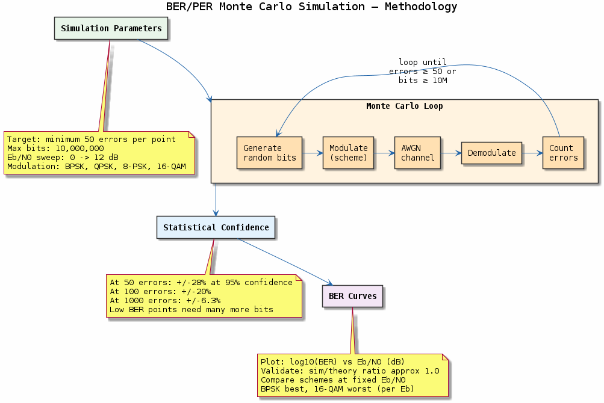
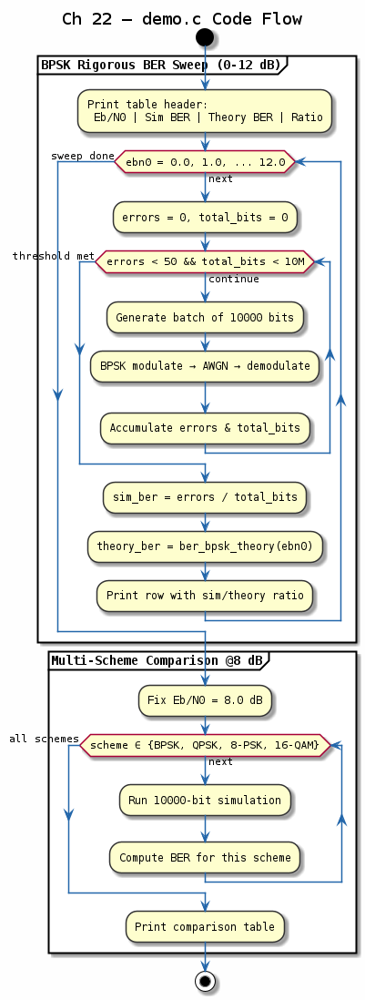

# Chapter 22 — BER/PER Monte Carlo Simulation

## Objective
Build a reusable Monte Carlo framework for measuring BER and PER across different Eb/N0 values.

## Key Concepts
- **Monte Carlo**: Run until statistically significant error count (e.g., 50+ errors)
- **Confidence**: More errors → smaller confidence interval
- **BER vs PER**: Frame error = any bit in frame wrong

---
## Diagrams

### Concept — Monte Carlo BER Methodology

Simulation parameters, the generate → modulate → channel → demodulate → count-errors Monte Carlo loop (run until ≥50 errors), statistical confidence intervals, and BER curve plotting.

### Code Flow — `demo.c`

Demo walkthrough: sweep Eb/N0 for BPSK, QPSK, 8-PSK, and 16-QAM, run the Monte Carlo engine at each point, and print simulated BER vs. theoretical predictions.

---
[← Link Budget](../21-link-budget/README.md) | [Next: MIMO →](../23-mimo/README.md)
