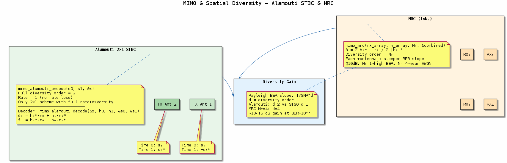
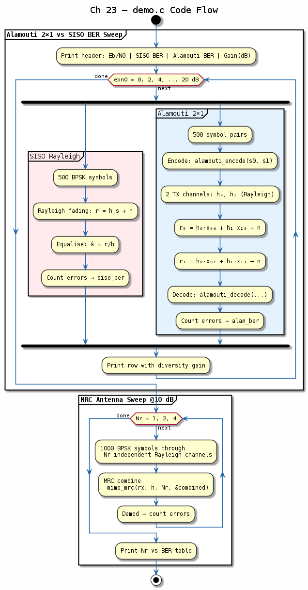

# Chapter 23 — MIMO & Spatial Diversity

## Objective
Implement spatial diversity techniques: Alamouti STBC, MRC, and ZF spatial multiplexing.

## Key Concepts
- **Diversity order**: More antennas → steeper BER slope
- **Alamouti STBC**: 2×1, full rate, full diversity, no CSI at TX needed
- **MRC**: Maximum ratio combining — optimal for 1×N_r
- **ZF detection**: (H^H·H)^{-1}·H^H·y — simple spatial multiplexing

---
## Diagrams

### Concept — MIMO & Spatial Diversity

Alamouti 2×1 STBC for full transmit diversity, MRC for optimal receive combining, and ZF spatial multiplexing — showing how multiple antennas improve BER slope or multiply throughput.

### Code Flow — `demo.c`

Demo walkthrough: Alamouti-encode QPSK symbols over a 2×1 Rayleigh channel, decode and compare BER vs. SISO; then ZF spatial multiplexing on a 2×2 channel.

---
[← BER Simulation](../22-ber-simulation/README.md) | [Next: Transceiver →](../24-transceiver/README.md)
