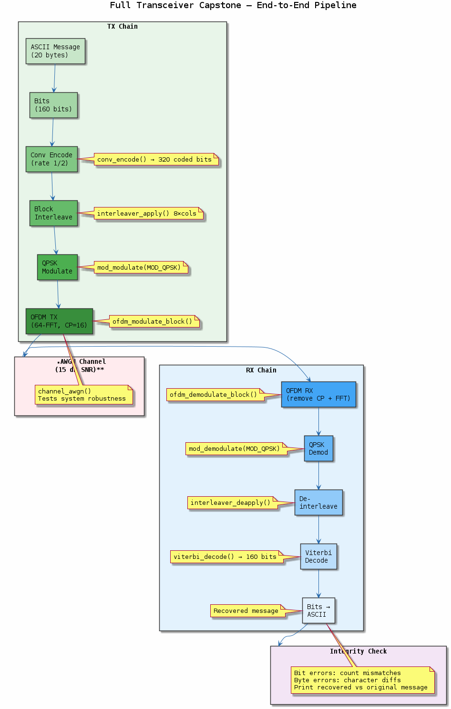
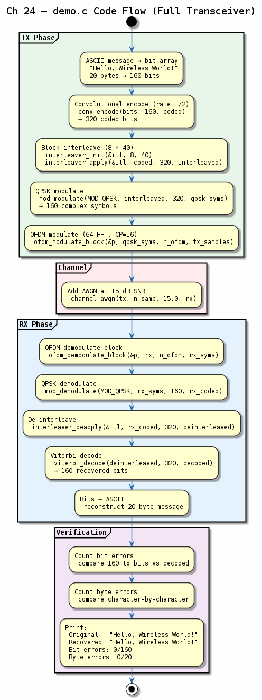

# Chapter 24 — Full Transceiver Capstone

## Objective
Combine everything into a complete TX → Channel → RX pipeline.

## Pipeline
```
TX: Message → Conv Encode → Interleave → QPSK → OFDM → [air]
                                                          ↓
RX: Message ← Viterbi ← Deinterleave ← QPSK Demod ← OFDM Demod
```

## Key Concepts
- **Integration**: All modules work together
- **Coded OFDM**: Convolutional code + block interleaver + QPSK + 64-point OFDM
- **Performance**: Measure BER at different SNR points
- **System design**: Buffer sizing, latency, throughput

---
## Diagrams

### Concept — Full Transceiver Pipeline


Capstone system: message → convolutional encode → interleave → QPSK modulate → OFDM → channel → OFDM demod → equalise → QPSK demod → deinterleave → Viterbi decode → recovered message.

### Code Flow — `demo.c`


Demo walkthrough: full coded-OFDM pipeline at multiple SNR points, measuring end-to-end BER with all modules integrated into a single TX → channel → RX chain.

---
[← MIMO](../23-mimo/README.md) | [Home](../../README.md)
